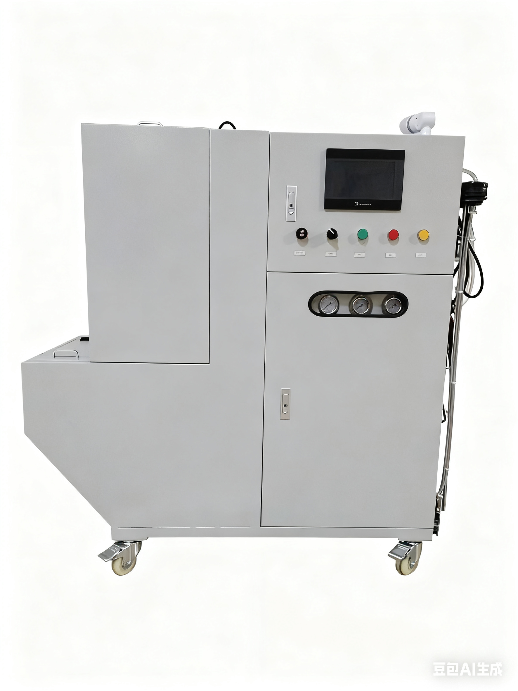

<!DOCTYPE html>
<html lang="zh-CN">
<head>
  <meta charset="UTF-8">
  <meta name="viewport" content="width=device-width, initial-scale=1.0">
  <title>东莞市锦鹰自动化设备有限公司 - 压铸自动化解决方案专家</title>
  
  <link href="https://cdn.jsdelivr.net/npm/font-awesome@4.7.0/css/font-awesome.min.css" rel="stylesheet">
  
  <link rel="preconnect" href="https://fonts.googleapis.com">
  <link rel="preconnect" href="https://fonts.gstatic.com" crossorigin>
  <link href="https://fonts.googleapis.com/css2?family=Inter:wght@300;400;500;600;700&display=swap" rel="stylesheet">
  
  <!-- Tailwind 配置 -->
  
  
  
</head>

<body class="font-inter text-dark bg-white">
  <!-- 导航栏 -->
  <header id="navbar" class="fixed w-full top-0 z-50 transition-all duration-300 bg-transparent">
    

      

        <!-- 公司Logo -->
        <a href="#" class="flex items-center space-x-2">
          

            锦鹰
          

          锦鹰自动化
        </a>
        
        <!-- 桌面导航 -->
        <nav class="hidden md:flex space-x-8">
          <a href="#home" class="text-white hover:text-accent transition-colors">首页</a>
          <a href="#about" class="text-white hover:text-accent transition-colors">关于我们</a>
          <a href="#products" class="text-white hover:text-accent transition-colors">产品中心</a>
          <a href="#cases" class="text-white hover:text-accent transition-colors">应用案例</a>
          <a href="#contact" class="text-white hover:text-accent transition-colors">联系我们</a>
        </nav>
        
        <!-- 联系电话 -->
        

          <i class="fa fa-phone"></i>
          13829267422
        

        
        <!-- 移动端菜单按钮 -->
        <button id="menuBtn" class="md:hidden text-white text-2xl">
          <i class="fa fa-bars"></i>
        </button>
      

    

    
    <!-- 移动端导航菜单 -->
    

      

        <a href="#home" class="text-primary hover:text-accent py-2 border-b border-gray-100">首页</a>
        <a href="#about" class="text-primary hover:text-accent py-2 border-b border-gray-100">关于我们</a>
        <a href="#products" class="text-primary hover:text-accent py-2 border-b border-gray-100">产品中心</a>
        <a href="#cases" class="text-primary hover:text-accent py-2 border-b border-gray-100">应用案例</a>
        <a href="#contact" class="text-primary hover:text-accent py-2">联系我们</a>
        

          <i class="fa fa-phone"></i>
          13829267422
        

      

    

  </header>

  <!-- 英雄区域 -->
  <section id="home" class="relative h-screen flex items-center justify-center overflow-hidden">
    <!-- 背景图：在此处添加公司主视觉图片 -->
    

      
      

    

    
    

      <h1 class="text-[clamp(2rem,5vw,4rem)] font-bold text-white leading-tight text-shadow-lg mb-6">
        东莞市锦鹰自动化设备有限公司
      </h1>
      

        专注于压铸行业自动化解决方案，提供高品质自动化机器设备，
        助力企业提升生产效率与产品质量
      

      

        <a href="#products" class="bg-accent hover:bg-accent/90 text-white font-medium py-3 px-8 rounded-md transition-all hover-lift">
          查看产品
        </a>
        <a href="#contact" class="bg-transparent border-2 border-white hover:border-accent text-white hover:text-accent font-medium py-3 px-8 rounded-md transition-all hover-lift">
          联系我们
        </a>
      

    

    
    <!-- 向下滚动指示 -->
    

      <i class="fa fa-angle-down text-3xl"></i>
    

  </section>

  <!-- 关于我们 -->
  <section id="about" class="section-padding bg-light">
    

      

        <h2 class="text-[clamp(1.5rem,3vw,2.5rem)] font-bold text-primary mb-4">关于锦鹰自动化</h2>
        

        
专注压铸自动化领域多年，致力于为客户提供高效、稳定、智能的自动化解决方案

      

      
      

        <!-- 公司图片：在此处添加公司厂房或团队图片 -->
        

          
          

            现代化生产基地
          

        

        
        

          <h3 class="text-2xl font-semibold text-primary mb-4">公司简介</h3>
          

            东莞市锦鹰自动化设备有限公司成立于2010年，是一家专业从事压铸行业自动化设备研发、生产、销售及服务的高新技术企业。
          

          

            公司拥有一支由机械设计、电气控制、软件开发等专业人才组成的技术团队，凭借多年行业经验和技术积累，为客户提供量身定制的自动化解决方案，帮助客户实现生产自动化、智能化升级，降低生产成本，提高生产效率和产品质量。
          

          
          

            

              

                <i class="fa fa-lightbulb-o text-xl"></i>
              

              

                <h4 class="font-semibold text-primary mb-1">技术创新</h4>
                
持续研发投入，保持技术领先

              

            

            

              

                <i class="fa fa-certificate text-xl"></i>
              

              

                <h4 class="font-semibold text-primary mb-1">品质保证</h4>
                
严格质量控制，确保设备稳定

              

            

            

              

                <i class="fa fa-users text-xl"></i>
              

              

                <h4 class="font-semibold text-primary mb-1">专业团队</h4>
                
资深工程师，丰富行业经验

              

            

            

              

                <i class="fa fa-headphones text-xl"></i>
              

              

                <h4 class="font-semibold text-primary mb-1">完善服务</h4>
                
售前咨询，售后技术支持

              

            

          

          
          <a href="#contact" class="inline-flex items-center text-primary font-medium hover:text-accent transition-colors">
            了解更多 <i class="fa fa-long-arrow-right ml-2"></i>
          </a>
        

      

      
      <!-- 公司数据 -->
      

        

          
10+

          
行业经验

        

        

          
50+

          
专业技术人员

        

        

          
300+

          
成功案例

        

        

          
98%

          
客户满意度

        

      

    

  </section>

  <!-- 产品中心 -->
  <section id="products" class="section-padding">
    

      

        <h2 class="text-[clamp(1.5rem,3vw,2.5rem)] font-bold text-primary mb-4">自动化机器设备</h2>
        

        
我们提供全系列压铸自动化设备，满足不同生产需求，提升生产效率

      

      
      <!-- 产品分类 -->
      

        <button class="product-filter active bg-primary text-white px-6 py-2 rounded-full text-sm font-medium">全部产品</button>
        <button class="product-filter bg-gray-100 hover:bg-primary/10 px-6 py-2 rounded-full text-sm font-medium transition-colors">压铸机器人</button>
        <button class="product-filter bg-gray-100 hover:bg-primary/10 px-6 py-2 rounded-full text-sm font-medium transition-colors">自动化生产线</button>
        <button class="product-filter bg-gray-100 hover:bg-primary/10 px-6 py-2 rounded-full text-sm font-medium transition-colors">检测设备</button>
        <button class="product-filter bg-gray-100 hover:bg-primary/10 px-6 py-2 rounded-full text-sm font-medium transition-colors">辅助设备</button>
      

      
      <!-- 产品列表 -->
      

        <!-- 产品1：在此处添加产品图片 -->
        

        

            <!-- 核心修改：移除固定尺寸，添加自适应规则 -->
             <!-- 自适应容器关键样式 -->
            

            热销产品
            

        

        

            <h3 class="text-xl font-semibold text-primary mb-2">JY-650 配比机</h3>
            
高精度伺服控制，快速响应，适用于各类压铸产品的自动取件、喷雾等工序

            

            ¥ 24000 起
            <a href="jy-650-details.html?id=1" class="text-secondary hover:text-accent transition-colors" class="text-secondary hover:text-accent transition-colors">
                查看详情 <i class="fa fa-arrow-right ml-1"></i>
            </a>
            

        

        

        <!-- 产品2：在此处添加产品图片 -->
        

          

            
          

          

            <h3 class="text-xl font-semibold text-primary mb-2">JY-1200 全自动压铸生产线</h3>
            
集成送料、压铸、取件、冷却、检测等工序，实现全自动化生产

            

              ¥ 180,000 起
              <a href="#" class="text-secondary hover:text-accent transition-colors">
                查看详情 <i class="fa fa-arrow-right ml-1"></i>
              </a>
            

          

        

        
        <!-- 产品3：在此处添加产品图片 -->
        

          

            
          

          

            <h3 class="text-xl font-semibold text-primary mb-2">JY-800 铸件尺寸检测设备</h3>
            
采用机器视觉技术，自动检测铸件尺寸精度，提高质检效率和准确性

            

              ¥ 56,000 起
              <a href="#" class="text-secondary hover:text-accent transition-colors">
                查看详情 <i class="fa fa-arrow-right ml-1"></i>
              </a>
            

          

        

        
        <!-- 产品4：在此处添加产品图片 -->
        

          

            
          

          

            <h3 class="text-xl font-semibold text-primary mb-2">JY-300 自动喷雾润滑系统</h3>
            
精准控制喷雾量和范围，提高模具寿命，减少脱模剂消耗

            

              ¥ 22,000 起
              <a href="#" class="text-secondary hover:text-accent transition-colors">
                查看详情 <i class="fa fa-arrow-right ml-1"></i>
              </a>
            

          

        

        
        <!-- 产品5：在此处添加产品图片 -->
        

          

            
            

              新品
            

          

          

            <h3 class="text-xl font-semibold text-primary mb-2">JY-500 机器人上下料系统</h3>
            
柔性自动化上下料解决方案，可与多种设备对接，提高生产效率

            

              ¥ 45,000 起
              <a href="#" class="text-secondary hover:text-accent transition-colors">
                查看详情 <i class="fa fa-arrow-right ml-1"></i>
              </a>
            

          

        

        
        <!-- 产品6：在此处添加产品图片 -->
        

          

            
          

          

            <h3 class="text-xl font-semibold text-primary mb-2">JY-700 自动化控制系统</h3>
            
智能化中央控制系统，实现多设备协同工作，可远程监控和管理

            

              ¥ 32,000 起
              <a href="#" class="text-secondary hover:text-accent transition-colors">
                查看详情 <i class="fa fa-arrow-right ml-1"></i>
              </a>
            

          

        

      

      
      

        <a href="#" class="inline-block bg-primary hover:bg-primary/90 text-white font-medium py-3 px-8 rounded-md transition-all hover-lift">
          查看全部产品 <i class="fa fa-arrow-right ml-2"></i>
        </a>
      

    

  </section>

  <!-- 技术优势 -->
  <section class="section-padding bg-primary text-white">
    

      

        <h2 class="text-[clamp(1.5rem,3vw,2.5rem)] font-bold mb-4">我们的技术优势</h2>
        

        
依托强大的研发实力和技术积累，为客户提供领先的自动化解决方案

      

      
      

        

          

            <i class="fa fa-cogs text-2xl text-accent"></i>
          

          <h3 class="text-xl font-semibold mb-4">定制化解决方案</h3>
          
根据客户生产需求和场地条件，量身定制自动化解决方案，确保设备与生产流程完美匹配

        

        
        

          

            <i class="fa fa-microchip text-2xl text-accent"></i>
          

          <h3 class="text-xl font-semibold mb-4">智能化控制系统</h3>
          
采用先进的PLC控制系统和人机界面，操作简单直观，可实现远程监控和数据分析

        

        
        

          

            <i class="fa fa-tachometer text-2xl text-accent"></i>
          

          <h3 class="text-xl font-semibold mb-4">高效稳定运行</h3>
          
设备运行稳定可靠，故障率低，生产效率高，大幅降低人工成本和产品不良率

        

      

      
      <!-- 数据对比图表 -->
      

        <h3 class="text-xl font-semibold mb-6 text-center">自动化前后生产效率对比</h3>
        

          <canvas id="efficiencyChart"></canvas>
        

      

    

  </section>

  <!-- 应用案例 -->
  <section id="cases" class="section-padding bg-light">
    

      

        <h2 class="text-[clamp(1.5rem,3vw,2.5rem)] font-bold text-primary mb-4">成功应用案例</h2>
        

        
我们的设备已成功应用于多家知名企业，帮助客户实现自动化生产升级

      

      
      

        <!-- 案例1：在此处添加案例图片 -->
        

          
          

          

            <h3 class="text-white font-semibold text-lg mb-1">汽车零部件压铸自动化生产线</h3>
            
某知名汽车零部件制造商

          

        

        
        <!-- 案例2：在此处添加案例图片 -->
        

          
          

          

            <h3 class="text-white font-semibold text-lg mb-1">摩托车配件自动化生产系统</h3>
            
某大型摩托车企业

          

        

        
        <!-- 案例3：在此处添加案例图片 -->
        

          
          

          

            <h3 class="text-white font-semibold text-lg mb-1">家电压铸件自动化生产线</h3>
            
某知名家电企业

          

        

        
        <!-- 案例4：在此处添加案例图片 -->
        

          
          

          

            <h3 class="text-white font-semibold text-lg mb-1">通讯设备零件自动化生产</h3>
            
某通讯设备制造商

          

        

        
        <!-- 案例5：在此处添加案例图片 -->
        

          
          

          

            <h3 class="text-white font-semibold text-lg mb-1">医疗器械零件自动化生产线</h3>
            
某医疗器械企业

          

        

        
        <!-- 案例6：在此处添加案例图片 -->
        

          
          

          

            <h3 class="text-white font-semibold text-lg mb-1">LED灯具配件自动化生产</h3>
            
某照明企业

          

        

      

      
      

        <a href="#" class="inline-block bg-white border border-primary text-primary hover:bg-primary hover:text-white font-medium py-3 px-8 rounded-md transition-all hover-lift">
          查看更多案例 <i class="fa fa-arrow-right ml-2"></i>
        </a>
      

    

  </section>

  <!-- 客户评价 -->
  <section class="section-padding">
    

      

        <h2 class="text-[clamp(1.5rem,3vw,2.5rem)] font-bold text-primary mb-4">客户评价</h2>
        

        
听听我们的客户怎么说

      

      
      

        

          

            <!-- 评价1：在此处添加客户logo -->
            

              

                

                  
                  

                    <h4 class="font-semibold text-primary">广州某汽车零部件有限公司</h4>
                    

                      <i class="fa fa-star"></i>
                      <i class="fa fa-star"></i>
                      <i class="fa fa-star"></i>
                      <i class="fa fa-star"></i>
                      <i class="fa fa-star"></i>
                    

                  

                

                

                  "锦鹰自动化的压铸生产线帮助我们实现了生产自动化，不仅提高了生产效率30%以上，还大大降低了产品不良率，非常满意他们的设备和服务。"
                

              

            

            
            <!-- 评价2：在此处添加客户logo -->
            

              

                

                  
                  

                    <h4 class="font-semibold text-primary">深圳某电子科技有限公司</h4>
                    

                      <i class="fa fa-star"></i>
                      <i class="fa fa-star"></i>
                      <i class="fa fa-star"></i>
                      <i class="fa fa-star"></i>
                      <i class="fa fa-star-half-o"></i>
                    

                  

                

                

                  "从设备安装调试到员工培训，锦鹰自动化的团队都表现出专业的素养。他们的自动化检测设备为我们节省了大量人力，检测精度也非常高。"
                

              

            

            
            <!-- 评价3：在此处添加客户logo -->
            

              

                

                  
                  

                    <h4 class="font-semibold text-primary">佛山某家电制造有限公司</h4>
                    

                      <i class="fa fa-star"></i>
                      <i class="fa fa-star"></i>
                      <i class="fa fa-star"></i>
                      <i class="fa fa-star"></i>
                      <i class="fa fa-star"></i>
                    

                  

                

                

                  "与锦鹰自动化合作多年，他们的设备稳定性好，售后服务响应及时，是我们值得信赖的合作伙伴。最近上线的全自动生产线更是让我们的产能提升了50%。"
                

              

            

          

        

        
        <!-- 滑动控制按钮 -->
        <button class="testimonial-prev absolute top-1/2 left-0 transform -translate-y-1/2 bg-white w-10 h-10 rounded-full shadow-md flex items-center justify-center text-primary hover:text-accent transition-colors z-10 md:-left-5">
          <i class="fa fa-angle-left text-xl"></i>
        </button>
        <button class="testimonial-next absolute top-1/2 right-0 transform -translate-y-1/2 bg-white w-10 h-10 rounded-full shadow-md flex items-center justify-center text-primary hover:text-accent transition-colors z-10 md:-right-5">
          <i class="fa fa-angle-right text-xl"></i>
        </button>
        
        <!-- 指示器 -->
        

          <button class="testimonial-dot w-3 h-3 rounded-full bg-primary"></button>
          <button class="testimonial-dot w-3 h-3 rounded-full bg-gray-300"></button>
          <button class="testimonial-dot w-3 h-3 rounded-full bg-gray-300"></button>
        

      

    

  </section>

  <!-- 联系我们 -->
  <section id="contact" class="section-padding bg-light">
    

      

        <h2 class="text-[clamp(1.5rem,3vw,2.5rem)] font-bold text-primary mb-4">联系我们</h2>
        

        
无论您有任何疑问或需求，都欢迎随时联系我们，我们将竭诚为您服务

      

      
      

        

          <form class="bg-white p-8 rounded-lg shadow-md">
            <h3 class="text-xl font-semibold text-primary mb-6">发送询价</h3>
            

              <label for="name" class="block text-gray-700 mb-2 text-sm">姓名</label>
              <input type="text" id="name" class="w-full px-4 py-2 border border-gray-300 rounded-md focus:outline-none focus:ring-2 focus:ring-primary/50 focus:border-primary" placeholder="请输入您的姓名">
            

            

              <label for="phone" class="block text-gray-700 mb-2 text-sm">电话</label>
              <input type="tel" id="phone" class="w-full px-4 py-2 border border-gray-300 rounded-md focus:outline-none focus:ring-2 focus:ring-primary/50 focus:border-primary" placeholder="请输入您的电话">
            

            

              <label for="company" class="block text-gray-700 mb-2 text-sm">公司名称</label>
              <input type="text" id="company" class="w-full px-4 py-2 border border-gray-300 rounded-md focus:outline-none focus:ring-2 focus:ring-primary/50 focus:border-primary" placeholder="请输入您的公司名称">
            

            

              <label for="message" class="block text-gray-700 mb-2 text-sm">留言</label>
              <textarea id="message" rows="4" class="w-full px-4 py-2 border border-gray-300 rounded-md focus:outline-none focus:ring-2 focus:ring-primary/50 focus:border-primary" placeholder="请输入您的需求或疑问"></textarea>
            

            <button type="submit" class="w-full bg-primary hover:bg-primary/90 text-white font-medium py-3 px-6 rounded-md transition-all hover-lift">
              提交询价
            </button>
          </form>
        

        
        

          

            <h3 class="text-xl font-semibold text-primary mb-6">联系方式</h3>
            
            

              

                

                  <i class="fa fa-map-marker"></i>
                

                

                  <h4 class="font-semibold text-primary mb-1">公司地址</h4>
                  
广东省东莞市清溪镇三星村三星路2号

                

              

              
              

                

                  <i class="fa fa-phone"></i>
                

                

                  <h4 class="font-semibold text-primary mb-1">联系电话</h4>
                  
13829267422

                

              

              
              

                

                  <i class="fa fa-envelope"></i>
                

                

                  <h4 class="font-semibold text-primary mb-1">电子邮箱</h4>
                  
ozyrro@163.com

                

              

              
              

                

                  <i class="fa fa-clock-o"></i>
                

                

                  <h4 class="font-semibold text-primary mb-1">工作时间</h4>
                  
周一至周五: 8:00 - 18:00

                  
周六: 9:00 - 15:00 (节假日除外)

                

              

            

            
            <!-- 微信二维码：在此处添加微信二维码图片 -->
            

              <h4 class="font-semibold text-primary mb-3">微信咨询</h4>
              

                
              

            

            
            <!-- 地图：可替换为实际地图 -->
            

              <h4 class="font-semibold text-primary mb-3">公司位置</h4>
              

                
              

            

          

        

      

    

  </section>

  <!-- 页脚 -->
  <footer class="bg-primary text-white pt-16 pb-8">
    

      

        

          

            

              锦鹰
            

            锦鹰自动化
          

          

            专注于压铸行业自动化解决方案，提供高品质自动化机器设备，助力企业提升生产效率与产品质量。
          

          

            <a href="#" class="bg-white/10 hover:bg-accent w-10 h-10 rounded-full flex items-center justify-center transition-colors">
              <i class="fa fa-weixin"></i>
            </a>
            <a href="#" class="bg-white/10 hover:bg-accent w-10 h-10 rounded-full flex items-center justify-center transition-colors">
              <i class="fa fa-weibo"></i>
            </a>
            <a href="#" class="bg-white/10 hover:bg-accent w-10 h-10 rounded-full flex items-center justify-center transition-colors">
              <i class="fa fa-linkedin"></i>
            </a>
            <a href="#" class="bg-white/10 hover:bg-accent w-10 h-10 rounded-full flex items-center justify-center transition-colors">
              <i class="fa fa-youtube-play"></i>
            </a>
          

        

        
        

          <h4 class="text-lg font-semibold mb-6">快速链接</h4>
          <ul class="space-y-3">
            <li><a href="#home" class="text-white/70 hover:text-accent transition-colors">首页</a></li>
            <li><a href="#about" class="text-white/70 hover:text-accent transition-colors">关于我们</a></li>
            <li><a href="#products" class="text-white/70 hover:text-accent transition-colors">产品中心</a></li>
            <li><a href="#cases" class="text-white/70 hover:text-accent transition-colors">应用案例</a></li>
            <li><a href="#contact" class="text-white/70 hover:text-accent transition-colors">联系我们</a></li>
          </ul>
        

        
        

          <h4 class="text-lg font-semibold mb-6">产品系列</h4>
          <ul class="space-y-3">
            <li><a href="#" class="text-white/70 hover:text-accent transition-colors">压铸机器人</a></li>
            <li><a href="#" class="text-white/70 hover:text-accent transition-colors">自动化生产线</a></li>
            <li><a href="#" class="text-white/70 hover:text-accent transition-colors">检测设备</a></li>
            <li><a href="#" class="text-white/70 hover:text-accent transition-colors">辅助设备</a></li>
            <li><a href="#" class="text-white/70 hover:text-accent transition-colors">自动化控制系统</a></li>
          </ul>
        

        
        

          <h4 class="text-lg font-semibold mb-6">联系我们</h4>
          <ul class="space-y-3">
            <li class="flex items-start">
              <i class="fa fa-map-marker mt-1 mr-3 text-accent"></i>
              广东省东莞市清溪镇三星村三星路2号
            </li>
            <li class="flex items-center">
              <i class="fa fa-phone mr-3 text-accent"></i>
              13829267422
            </li>
            <li class="flex items-center">
              <i class="fa fa-envelope mr-3 text-accent"></i>
              ozyrro@163.com
            </li>
          </ul>
        

      

      
      

        

          

            &copy; 2023 东莞市锦鹰自动化设备有限公司 版权所有 | 粤ICP备XXXXXXXX号
          

          

            <a href="#" class="text-white/50 hover:text-white text-sm transition-colors">隐私政策</a>
            <a href="#" class="text-white/50 hover:text-white text-sm transition-colors">服务条款</a>
            <a href="#" class="text-white/50 hover:text-white text-sm transition-colors">网站地图</a>
          

        

      

    

  </footer>

  <!-- 返回顶部按钮 -->
  <button id="backToTop" class="fixed bottom-8 right-8 bg-primary hover:bg-accent text-white w-12 h-12 rounded-full shadow-lg flex items-center justify-center transition-all opacity-0 pointer-events-none z-50">
    <i class="fa fa-angle-up text-xl"></i>
  </button>

  <!-- JavaScript -->
  
</body>
</html>
